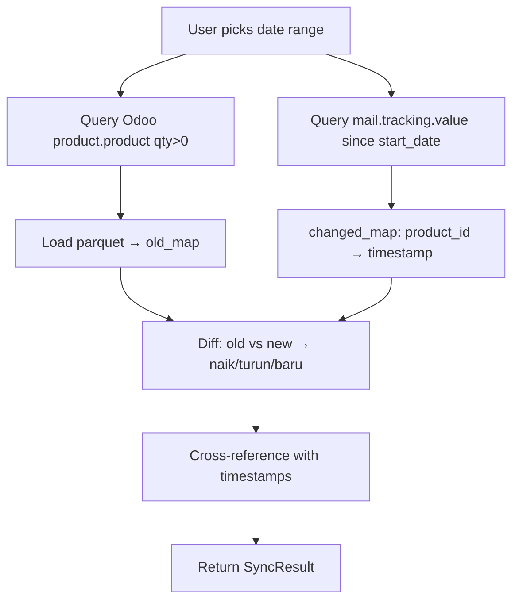

# Price Sync Redesign — Odoo + Parquet Change Detection
**Date**: 2026-07-01

## Overview
Replace IndexedDB+Odoo price sync with direct Odoo+parquet change detection using `mail.tracking.value` for price-specific timestamps. Remove dependency on IndexedDB entirely.

## Architecture

### Core Change
New service `OdooPriceChangeDetector` in `logic/odoo_price_sync.py` replaces `IndexedDBPriceSyncService`. User selects a date range → system detects products where `list_price` changed in that period + new products.



### Fallback Chain
1. **Primary** — `mail.tracking.value` for `list_price` field (presisi tinggi)
   - `ir.model.fields` → get field_id for `product.product.list_price`
   - `mail.tracking.value` → `[("field_id", "=", fid), ("create_date", ">=", start)]`
   - `mail.message` → resolve `res_id` to product ID
2. **Fallback** — `write_date` on `product.product` (1 RPC, false positive non-harga)
   - `[("qty_available", ">", 0), ("write_date", ">=", start)]`
3. **Final fallback** — raise exception, user retries

## Performance & Risks

| Area | Risk | Mitigation |
|------|------|------------|
| RPC count | 3-5 RPC per deteksi | RPC #2 #3 #4 parallelizable (independent) |
| Range >30 hari | mail.tracking return ribuan | Limit UI to max 30 days, show warning >14 days |
| Tracking kosong (new instance) | No data | Fallback write_date |
| Field ID not found | Import error | Cache at module init, fallback write_date |
| Mass import (no tracking) | No mail tracking entries | write_date fallback covers this |

## Files

### Modified
- `logic/odoo_price_sync.py` — Add `detect_changes(start_date: date)`, remove IndexedDB-dependent methods
- `ui/pages/price_sync.py` — New UI with date range selector + results table

### Removed
- `logic/indexeddb_price_sync.py` — Entire file, replaced by parquet+mail tracking
- `utils/indexeddb_bridge.py` — No longer needed by any page

## Data Flow

### detect_changes(start_date)
```
1. Parallell:
   a. Query product.product (qty > 0) → barcode, name, list_price, id
   b. Load parquet → {barcode: {list_price, diskon}}
   c. Get field_id for list_price (cached)
   d. Query mail.tracking.value (create_date >= start, field = list_price)

2. Join product.product with tracking:
   → {product_id: {"barcode":..., "name":..., "list_price":..., "last_changed": timestamp}}

3. Diff with parquet:
   for each p in odoo_products:
       old = parquet.get(p.barcode)
       if old is None:
           type = "new"  # Produk Baru
       elif p.list_price > old.list_price:
           type = "increase"  # Harga Naik
       elif p.list_price < old.list_price:
           type = "decrease"  # Harga Turun
       else:
           continue  # unchanged

4. Return SyncResult {changes: [PriceChange, ...], metadata: {total, range}}
```

### PriceChange dataclass
```python
@dataclass
class PriceChange:
    barcode: str
    name: str
    change_type: str  # "increase" | "decrease" | "new"
    old_price: float | None
    new_price: float
    changed_at: str | None  # ISO timestamp from tracking/write_date
```

## Edge Cases

1. **Empty range** (3 hari, no changes) → empty result, info message
2. **No parquet yet** (first run) → all in-stock products = "new"
3. **Product removed from stock** → not in Odoo qty>0, still in parquet → skip (not detected as "removed" — qty filter handles this)
4. **Mail tracking returns old_value_float = new_value_float** (non-price edit) → filter by domain field_id ensures only list_price changes
5. **Concurrent access** — read-only operation, safe
